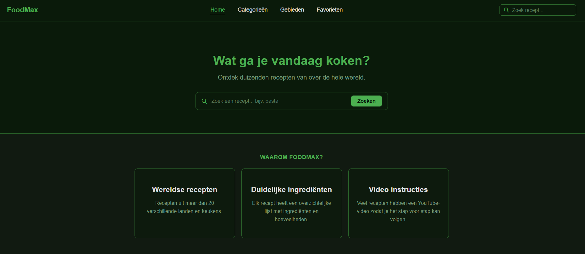
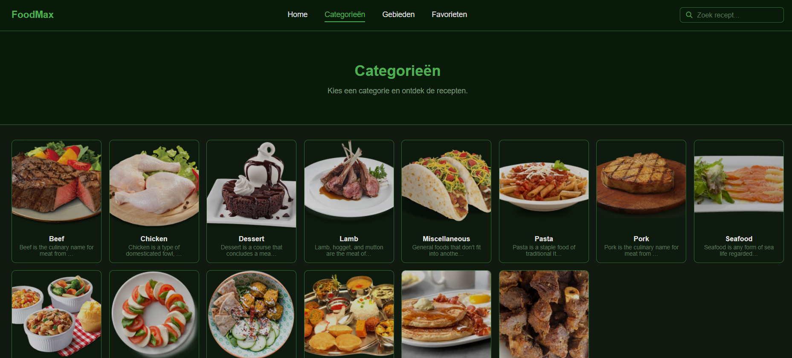
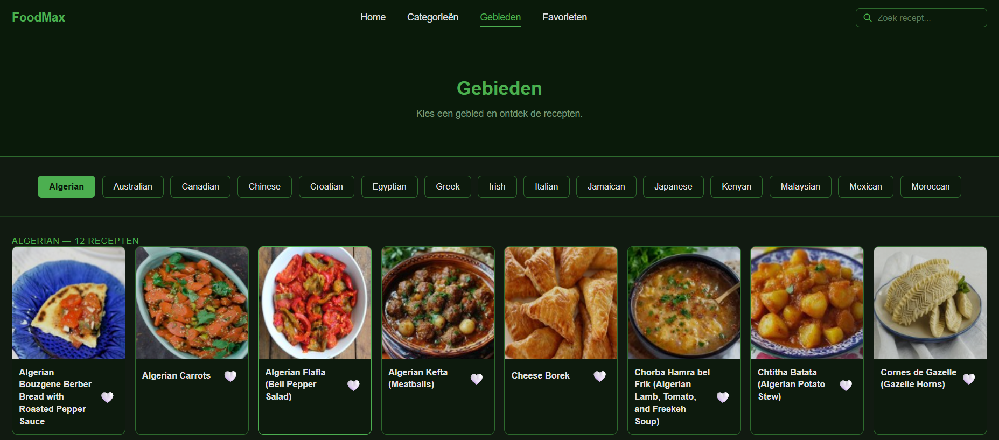
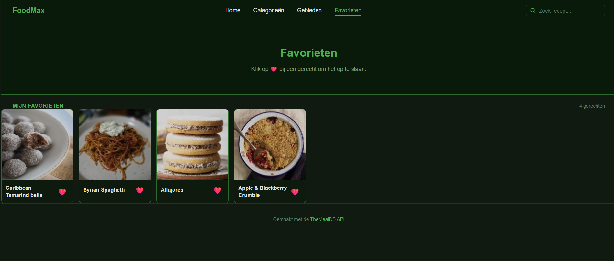

# Souleyman Web Advanced eindproject

# FoodMax

Een recepten-webapplicatie gebouwd met de TheMealDB API. Gebruikers kunnen recepten zoeken, bladeren per categorie of gebied, en favorieten opslaan.


## Screenshots






## Gebruikte API

- **TheMealDB API**: https://www.themealdb.com/api.php
  - Gratis API voor recepten, categorieën en keukens wereldwijd.


## Installatiehandleiding

### Vereisten
- [Node.js](https://nodejs.org/) geïnstalleerd

### Stappen

```bash
# 1. Clone de repository
git clone https://github.com/jouw-gebruikersnaam/foodmax.git

# 2. Ga naar de projectmap
cd foodmax

# 3. Installeer dependencies
npm install

# 4. Start de ontwikkelserver
npm run dev

# 5. Build voor productie
npm run build
```


## Folderstructuur
foodmax/
├── dist/               <- productie build (gegenereerd door Vite)
├── src/
│   ├── index.html      <- hoofd HTML bestand
│   ├── style.css       <- alle CSS stijlen
│   ├── categories.js   <- logica voor categorieënpagina
│   ├── gebieden.js     <- logica voor gebiedenpagina
│   ├── favorites.js    <- logica voor favorietenpagina
│   ├── search.js       <- logica voor zoekpagina
│   └── nav.js          <- navigatie tussen pagina's
├── package.json
├── vite.config.js
└── README.md


## Technische vereisten

### 1. DOM Manipulatie

| Concept | Waar | Uitleg |
|---|---|---|
| Elementen selecteren | `categories.js` | `document.getElementById('inhoud-categories')` om de container te selecteren |
| Elementen manipuleren | `categories.js`, `gebieden.js` | `.innerHTML = html` om inhoud dynamisch in te vullen |
| Events koppelen | `gebieden.js` | `btn.onclick = () => kiesGebied(r.area, btn)` — klikgebeurtenis op gebiedknoppen |


### 2. Modern JavaScript

| Concept | Waar | Uitleg |
|---|---|---|
| Constanten | Alle JS bestanden | `const API = 'https://www.themealdb.com/api/json/v1/1/'` — API URL als constante |
| Template literals | `search.js` | Zoekresultaten voor "${q}" — dynamische strings met backticks |
| Iteratie over arrays | `categories.js` | `d.categories.forEach(c => { ... })` — iteratie over categorieën |
| Array methodes | `gebieden.js` | `d.meals.map(...)`, `.filter(r => r.heeft)`, `.some(...)` |
| Arrow functions | Alle JS bestanden | `d.meals.forEach(m => { ... })` — pijlfuncties overal gebruikt |
| Ternary operator | `categories.js` | `(isFavoriet(m.idMeal) ? 'hartje' : 'leeg hartje')` — hartje tonen op basis van favorietstatus |
| Callback functions | `gebieden.js` | `.then(r => r.json()).then(data => ({ ... }))` — callbacks in Promise chain |
| Promises | `gebieden.js` | `Promise.all(checks)` — meerdere API calls tegelijk uitvoeren |
| Async & Await | Alle JS bestanden | `async function laadCategorieën() { const r = await fetch(...) }` |
| Observer API | `nav.js` | `IntersectionObserver` gebruikt om fade-in animatie te triggeren bij kaartjes |


### 3. Data & API

| Concept | Waar | Uitleg |
|---|---|---|
| Fetch | Alle JS bestanden | `fetch(API + 'categories.php')` — data ophalen van TheMealDB |
| JSON manipuleren | Alle JS bestanden | `const d = await r.json()` — JSON omzetten naar JS object en weergeven |


### 4. Opslag & Validatie

| Concept | Waar | Uitleg |
|---|---|---|
| Formulier validatie | `nav.js` | Zoekterm wordt gecontroleerd: lege zoekopdracht toont foutmelding |
| LocalStorage | `favorites.js` | `localStorage.setItem('foodmax_favorieten', ...)` — favorieten opslaan en laden |


### 5. Styling & Layout

| Concept | Waar | Uitleg |
|---|---|---|
| Flexbox | `style.css` | Navbar gebruikt `display: flex` voor horizontale layout |
| CSS Grid | `style.css` | `.meal-grid { display: grid; grid-template-columns: repeat(auto-fill, minmax(160px, 1fr)) }` |
| Gebruiksvriendelijke elementen | Overal | Hartjesknop voor favorieten, terug-knop met pijl, loader animatie |


### 6. Tooling & Structuur

| Concept | Waar | Uitleg |
|---|---|---|
| Vite | `package.json` | Project opgezet met Vite via `npm create vite@latest` |
| Folderstructuur | Zie mapstructuur hierboven | Gescheiden HTML, CSS en JS bestanden in `src/` map |


## Gebruikte bronnen

- TheMealDB API documentatie: https://www.themealdb.com/api.php
- Tabler Icons: https://tabler-icons.io
- MDN Web Docs (fetch, localStorage, Promise): https://developer.mozilla.org
- AI chatlog: bijgevoegd als `chatlog.md` in de repository


## Functionaliteiten

- Recepten zoeken op naam
- Bladeren per categorie (Beef, Chicken, Pasta...)
- Bladeren per land/gebied
- Favorieten opslaan en verwijderen
- Receptdetail met ingredienten en YouTube-link
- Favorieten blijven bewaard na herladen (LocalStorage)

## Ai gebruik

https://mammouth.ai/shared/f952eba4-8b5f-4f7b-acdb-ee2ec486d668

